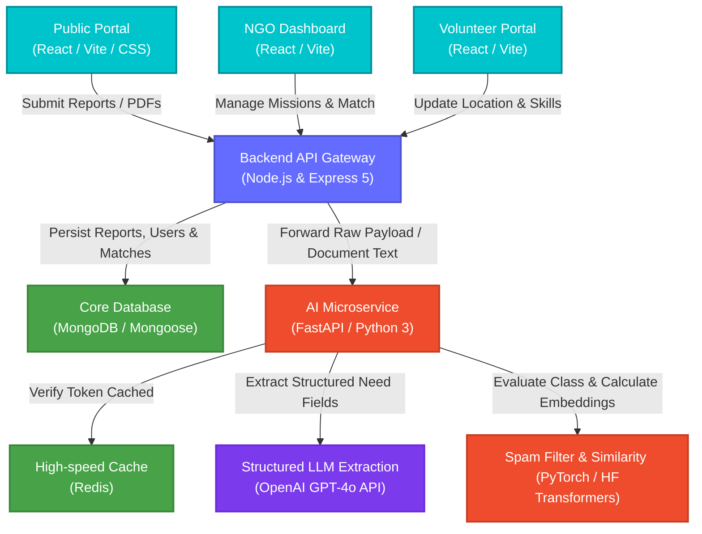

<h1 align="center">🤝 ReliefSync AI</h1>

<p align="center">
  <strong>An Intelligent, Production-Ready Disaster Relief Ingestion, Analysis, & Volunteer Coordination Engine.</strong>
</p>

<p align="center">
  <a href="#-key-modules">Key Modules</a> •
  <a href="#-system-architecture--telemetry-flow">Architecture</a> •
  <a href="#%EF%B8%8F-tech-stack-deep-dive">Tech Stack</a> •
  <a href="#-api-endpoint-registry">API Registry</a> •
  <a href="#%EF%B8%8F-data-schemas">Database Schemas</a> •
  <a href="#-getting-started">Getting Started</a> •
  <a href="#-performance-bottlenecks--solutions">Bottlenecks & Solutions</a>
</p>

<p align="center">
  
  
  
</p>

---

## 📖 Overview
**ReliefSync AI** is a multi-tier disaster relief coordination workspace. The platform ingests chaotic, unstructured community complaints (via raw text and PDF document uploads) and extracts structured situational metrics using LLMs. It then filters out spam, classifies severity, coordinates skill-based matching for local volunteers, sends out automatic SLA-based email notifications, and manages escalations for unresolved emergencies.


## 🚀 Key Modules

### 1. Intelligent Data Ingestion & Extraction (LLM Pipeline)
The system processes text and multi-page PDF documents. The ingestion engine strips raw text and passes it to the AI extraction pipeline. 
*   **Structured Parsing:** Uses an OpenAI GPT model to convert natural language descriptions of disaster environments into uniform JSON structures.
*   **Needs Parsing:** Extracts specific counts of affected citizens, lists matching tools/skills needed, and determines priority levels automatically.

### 2. Local Spam Filter & NLP Classifiers
A Python-based AI microservice evaluates reports to eliminate noise before database ingestion.
*   **Spam Detection:** Runs incoming complaints through a localized Hugging Face NLP model to filter out duplicate, irrelevant, or spam submissions.
*   **Incident Classification:** Automatically labels incidents into categories (e.g., `MEDICAL_SUPPORT`, `FOOD_RELIEF`, `SHELTER_SUPPORT`, `DISASTER_RELIEF`, `GENERAL_SUPPORT`) to router them to NGOs specialized in those functions.

### 3. Geolocation & Skill-Based Matching
An automated matchmaker pairs disaster cases with active responders.
*   **Geospatial Proximity:** Filters volunteers based on coordinate distance.
*   **Skill Scoring:** Matches skills needed by the incident (e.g., "First Aid", "Debris Removal", "Search & Rescue") with volunteer skill profile tags.
*   **Concurrency Controls:** Prevents overloading volunteers by respecting the `maxActiveAssignments` parameter.

### 4. SLA Monitoring & Escalation Engine
A cron-based monitoring loop watches open incidents to guarantee response quality.
*   **SLA Compliance:** If an incident offer remains unassigned or an NGO fails to respond within the designated SLA window, the escalation system triggers.
*   **Notification Engine:** Automatically dispatches alerts via Nodemailer (SMTP/Gmail) to notify NGO coordinators of high-priority events, and to volunteers for new task assignments.

---

## 🎨 System Architecture & Telemetry Flow

The diagram below details the data ingestion, classification, schema extraction, caching, and matching pathways across our three core layers.



---

## 🛠️ Tech Stack Deep Dive

<details open>
<summary><b>Click to expand full technology stack choices</b></summary>

| Component | Technology | Rationale & Responsibility | Key Badges |
| :--- | :--- | :--- | :--- |
| **Frontend** | React 18, Vite | Handles live dashboards, NGO analytics, and volunteer dispatch panels. Powered by Vite for high-speed HMR. |   |
| **Backend API** | Node.js, Express 5, JWT | Authenticates administrators and volunteers. Orchestrates Nodemailer alerts, coordinates database updates, and delegates AI tasks. |   |
| **AI Microservice** | FastAPI, PyTorch, Hugging Face | Hosts custom spam-classifier weights and sentence embeddings models, serving API hooks to clean and convert unstructured text. |    |
| **Databases** | MongoDB, Redis | MongoDB stores application collections (NGO, User, Volunteer, Complaint, Assignment). Redis caches AI model inference mappings. |   |
| **Extraction** | OpenAI API | Standardizes variable disaster descriptions into rigid structured payloads containing priority and volume attributes. |  |

</details>

---

## 🔌 API Endpoint Registry

<details>
<summary><b>Click to view route specification and JSON payloads</b></summary>

### 1. Authentication Endpoints (`/api/auth`)
*   `POST /api/auth/register-ngo` — Register an NGO user details.
*   `POST /api/auth/login` — Authenticate user/volunteer. Returns JWT token.

### 2. Ingest & AI Processing Endpoints (`/api/reports` / `/api/summaries`)
*   `POST /api/reports/text` — Parse raw text payload into structured metrics.
*   `POST /api/reports/pdf` — Multipart form upload (`pdf` file field) to parse multi-page documents.
*   `POST /api/summaries/generate` — Trigger summarization of cases.

#### Sample Request Body: Ingestion (POST `/api/reports/text`)
```json
{
  "text": "A severe flash flood occurred near Noida Sector 62. Multiple people are trapped inside a collapsed house. We need at least three paramedics and search and rescue volunteers immediately."
}
```

#### Sample Response Payload (POST `/api/reports/text`)
```json
{
  "success": true,
  "data": {
    "summary": "Flash flood near Noida Sector 62 with citizens trapped inside a collapsed structure. Paramedics and search & rescue needed.",
    "category": "DISASTER_RELIEF",
    "severity": "CRITICAL",
    "locationHint": "Noida Sector 62",
    "requiredPeople": 3,
    "requiredSkills": ["First Aid", "Search & Rescue"],
    "needsClarification": false,
    "clarificationQuestions": []
  }
}
```

### 3. Volunteer & Matchmaking (`/api/matching` / `/api/assignments`)
*   `GET /api/matching/needs/:needId/recommendations` — Fetch recommended volunteers for a specific need sorted by distance proximity and skill score.
*   `POST /api/assignments` — Dispatch a volunteer to a matching need.
*   `PUT /api/assignments/:id/status` — Update task status.

</details>

---

## 🗄️ Data Schemas

Our database is structured using Mongoose schemas. Below are the details:

*   **NGO**:
    *   `name`: (String, required)
    *   `email`: (String, unique)
    *   `supportedCategories`: Array of strings (e.g. `MEDICAL_SUPPORT`, `FOOD_RELIEF`, `SHELTER_SUPPORT`, `DISASTER_RELIEF`).
    *   `capacityConfig`: Object tracking max active cases and auto-dispatch policies.
    *   `verificationStatus`: ENUM (`PENDING`, `VERIFIED`, `REJECTED`).
*   **User**:
    *   `name`, `email`, `password` (bcrypt hash).
    *   `role`: ENUM (`admin`, `volunteer`, `superadmin`).
    *   `ngoId`: Reference to NGO (nullable).
*   **Volunteer**:
    *   `skills`: Array of tags.
    *   `location`: Geospatial indices.
    *   `availability`: ENUM (`available`, `assigned`, `offline`).
    *   `maxActiveAssignments`: (Number, default 3).
*   **Complaint**:
    *   `originalText`: Raw report text.
    *   `aiExtractedData`: Parsed metrics (summary, location, severity).
    *   `isSpam`: Boolean classification flag.
*   **Escalation**:
    *   `complaintId`: Reference to Complaint.
    *   `reason`, `priority`, `message`.

---

## 📦 Getting Started

### 1. Set Up Environment Variables

<details>
<summary><b>Backend Variables (`Backend/.env`)</b></summary>

```env
MONGO_URL=mongodb://localhost:27017/reliefsync
PORT=5000
JWT_SECRET=YOUR_JWT_SIGNING_SECRET
OPENAI_API_KEY=sk-proj-...
EMAIL_USER=your_gmail@gmail.com
EMAIL_PASS=your_gmail_app_password
```
</details>

<details>
<summary><b>AI Microservice Variables (`AI-Service/.env`)</b></summary>

```env
AI_SERVICE_API_KEY=YOUR_API_VERIFICATION_KEY
REDIS_CACHE_ENABLED=true
REDIS_URL=redis://127.0.0.1:6379/0
```
</details>

### 2. Seed Database & Run Services

To speed up development, we provide a pre-configured database seed script that initializes a verified NGO user account (`ngo@reliefsync.local` / `ngo12345`) and a volunteer account (`volunteer@reliefsync.local` / `volunteer12345`).

You can verify your email configuration using the test script: `node scripts/testEmail.js`.

```bash
# ---------------------------------------------
# Terminal 1: Ingest Demo Data & Start Backend
# ---------------------------------------------
cd Backend
npm install

# Test SMTP Credentials
node scripts/testEmail.js

# Seed the MongoDB database with demo entities:
npm run seed

# Start backend server:
npm run dev

# ---------------------------------------------
# Terminal 2: Start Frontend Dashboard
# ---------------------------------------------
cd Frontend
npm install
npm run dev

# ---------------------------------------------
# Terminal 3: Start AI Microservice
# ---------------------------------------------
cd AI-Service
# Activate python virtualenv (Windows)
.venv\Scripts\Activate.ps1
# Activate python virtualenv (Linux/Mac)
source .venv/bin/activate

pip install -r requirements.txt
uvicorn main:app --reload --port 8000
```

---

## 📁 Repository Structure

```
ReliefSync-AI/
├── Frontend/           # UI Single Page Application (React/Vite)
│   ├── src/
│   │   ├── components/ # Reusable layout components
│   │   └── views/      # NGO, Volunteer & Admin Dashboards
├── Backend/            # REST API Gateway
│   ├── scripts/        # Database seeders & verification tools
│   │   ├── createDemoData.js   # Main database seed utility
│   │   └── testEmail.js        # SMTP configuration diagnostic script
│   ├── src/
│   │   ├── models/     # Document structures
│   │   └── services/   # Business validation, email & matching engine
├── AI-Service/         # FastAPI ML Pipelines
│   ├── routes/         # Model inferencing endpoints
│   └── services/       # PyTorch initialization & Cache controls
└── assets/             # Layout visual assets & documentation banners
```

---

## 🚀 Future Roadmap

- [ ] **Background Task Queue**: Integrate Redis-backed job workers (e.g. BullMQ/Celery) to separate AI extraction from API endpoint lifecycles.
- [ ] **GIS / Mapbox Integrations**: Direct volunteer mapping and location-based spatial filtering on live vector maps.
- [ ] **Offline PWA Support**: Enable remote, offline report drafting via standard browser Service Workers.
- [ ] **Vector Engine Migration**: Switch query similarity logic to a vector-native engine (Qdrant/Pinecone) for sub-millisecond volunteer matches.

---

## ⚡ Performance Bottlenecks & Solutions

### 1. Synchronous LLM Ingestion Latency
*   **Context:** Generating needs from PDF documents requires a sequential call to the OpenAI API which takes 3-5s. Under high disaster traffic, this blocks server connections.
*   **Frontend-focused Solution:** We will convert the API call to a non-blocking asynchronous task. The server will immediately return `202 Accepted` along with a job ID. The React frontend will display a sleek, animated skeleton/progress screen while polling for final completion status via WebSocket streams or simple polling, keeping the user interface extremely responsive and fluid.

### 2. High-Overhead CPU Inference
*   **Context:** Hugging Face text embedding and spam checks execute locally. When hosted on CPU instances, this spikes core utilization and triggers throttling.
*   **Engineering Solution:** Offload model loops to serverless GPU inference clusters (such as Hugging Face Inference Endpoints or AWS SageMaker) and utilize Redis cache keys to bypass model calculations entirely for redundant payloads.

### 3. Complex Geospatial Similarity Aggregation
*   **Context:** Correlating volunteer coordinates and skill profiles in real-time requires expensive MongoDB `$geoNear` aggregate runs, leading to response latency.
*   **Engineering Solution:** Offload high-dimensional vectors to a dedicated search store (e.g., Pinecone or Qdrant) allowing high-velocity approximate nearest neighbor searches.
