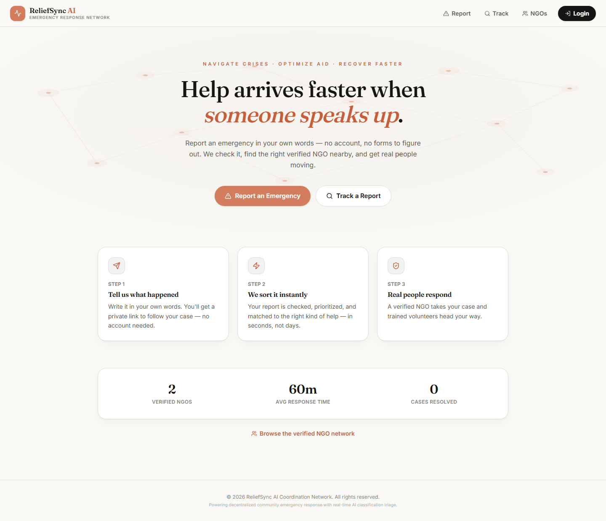
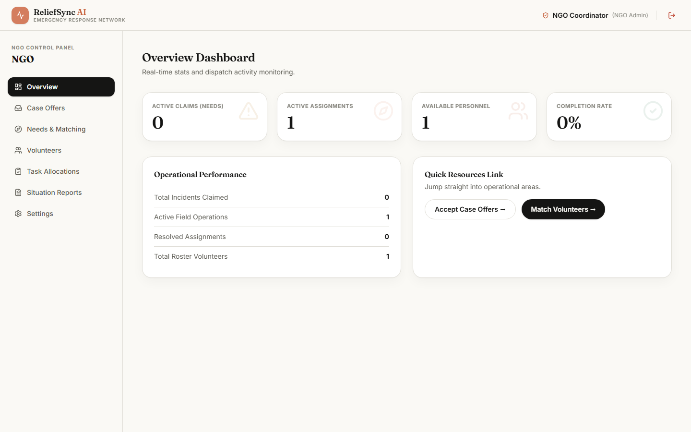
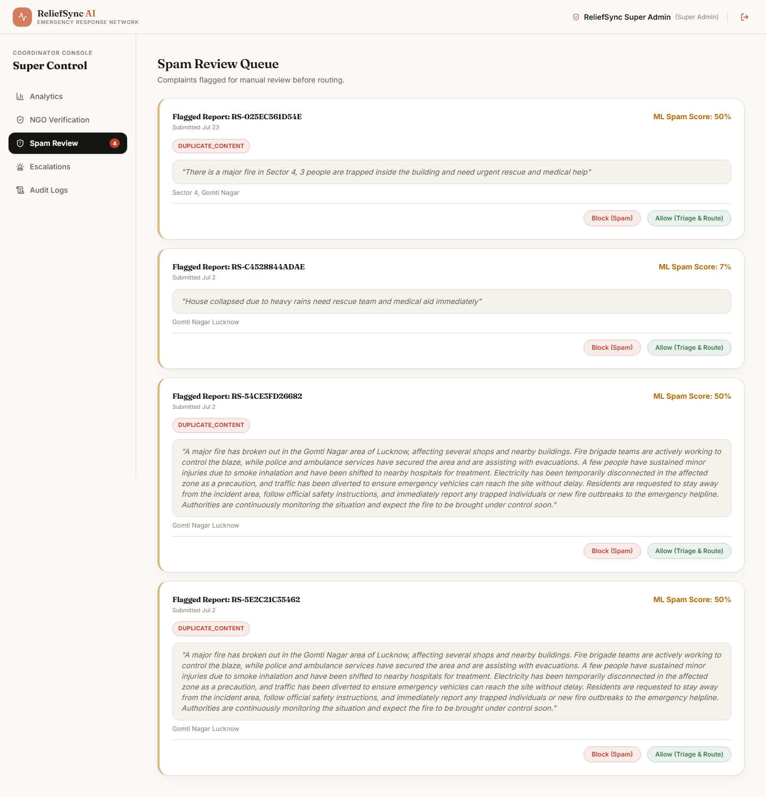
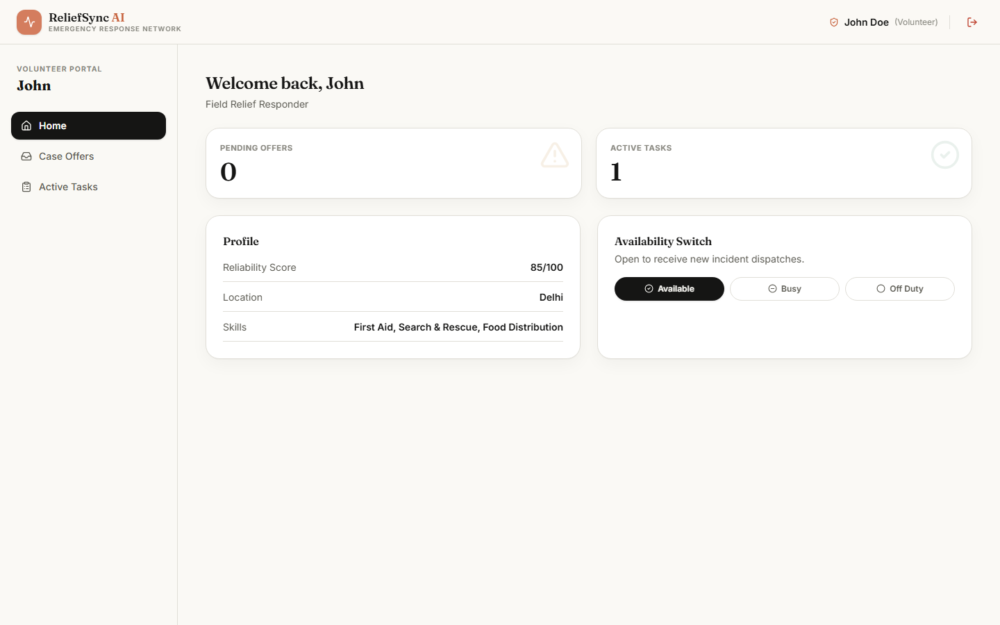
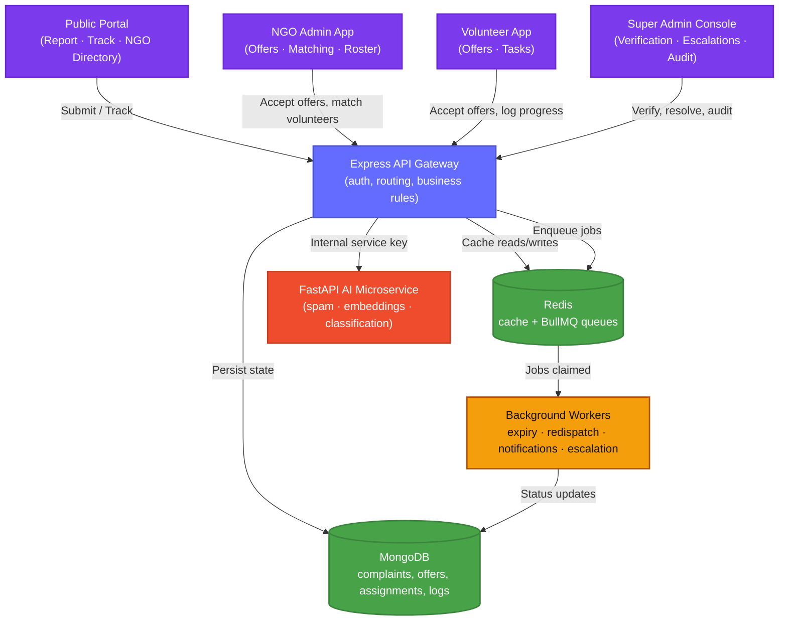

<div align="center">

# 🤝 ReliefSync AI

**AI-assisted disaster & community relief coordination — from a public complaint to a dispatched volunteer, with safety-conscious automation the whole way.**

[](#)
[](#)
[](#)
[](#)
[](#)

[Overview](#-overview) • [Features](#-what-it-does) • [Architecture](#-architecture) • [Tech Stack](#%EF%B8%8F-tech-stack) • [Design](#-design-language) • [Getting Started](#-getting-started) • [Deployment](#%EF%B8%8F-deployment) • [API Surface](#-api-surface) • [Roadmap](#-roadmap)

</div>

---

## 📖 Overview

During a crisis, reports arrive messy, duplicated, and at volume. **ReliefSync AI** is a backend-first coordination platform that takes raw public complaints — submitted with no login required — and automatically:

1. Screens them for spam, with **emergency language always protected from auto-blocking**
2. Detects duplicates by *meaning*, not just exact text, using multilingual sentence embeddings
3. Classifies category and severity with a hybrid of deterministic rules and a zero-shot ML model
4. Routes the case to **verified NGOs** in waves, with automatic expiry and redispatch if nobody responds
5. Matches and offers the case to suitable **volunteers** once an NGO accepts
6. Notifies everyone involved and **escalates to a human coordinator** when automation hits a dead end

Every AI decision is conservative by design: models suggest, rules and humans stay in control of anything high-stakes. Every step is logged, so the full lifecycle of a complaint is auditable end to end.

<p align="center">
  
</p>

---

## ✨ What It Does

<table>
<tr>
<td width="50%" valign="top">

### 🛡️ Safety-First AI Triage
- Rule-based spam screening **plus** a pretrained BERT spam classifier
- Hybrid decision policy — a model alone can never silently block an emergency-sounding report
- Semantic duplicate detection via `intfloat/multilingual-e5-small` embeddings, catching reworded duplicates exact-match would miss
- Category & severity classification blending deterministic rules with a multilingual zero-shot classifier; severity can be raised automatically but never silently lowered

</td>
<td width="50%" valign="top">

### 🚑 Verified Routing & Matching
- Only **verified** NGOs are eligible for automatic routing
- Offers dispatch in ranked waves (category fit, service area, capacity, SLA, reliability) — not a blast to everyone at once
- Once an NGO accepts, volunteers are ranked and offered the same way
- Atomic claim logic — two NGOs (or two volunteers) can never grab the same case

</td>
</tr>
<tr>
<td width="50%" valign="top">

### ⏱️ Background Reliability
- BullMQ + Redis workers handle offer expiry, redispatch waves, notification delivery, and escalation sweeps off the request path
- Redis also caches AI model outputs and workflow calls — and **fails open**, so a Redis outage degrades gracefully instead of breaking submissions
- Idempotent notification outbox — the same event can never fire two duplicate alerts

</td>
<td width="50%" valign="top">

### 🧭 Full Coordination Loop
- Secure, tokenized complaint tracking for anonymous citizens (raw token never touches the database — only its hash)
- NGO dashboard: case offers, AI volunteer matching, roster management, task allocations, situation reports, routing settings
- Volunteer portal: availability switch, offers, live per-task progress logging
- Super Admin console: NGO verification, spam review queue, escalations, and a full AI agent + notification audit trail

</td>
</tr>
</table>

<p align="center">
  
  
</p>
<p align="center">
  
</p>

---

## 🏗️ Architecture

ReliefSync AI is split into two backend services on purpose: **Express owns every business decision and database write**; the **FastAPI service only returns model scores** over an internal, authenticated API. This keeps AI inference swappable and testable in isolation from routing/dispatch logic.



---

## 🛠️ Tech Stack

| Layer | Technology | Responsibility |
| :--- | :--- | :--- |
| **Frontend** | React 19, React Router, TanStack Query, Tailwind CSS v4, Vite | Role-based dashboards (public, NGO, volunteer, super admin) with real URL routing, live data caching, and a warm editorial design system |
| **Backend API** | Node.js, Express 5, JWT, Mongoose | Auth, business rules, atomic routing/matching logic, all database writes |
| **AI Microservice** | FastAPI, PyTorch, Hugging Face Transformers | Spam classification, multilingual duplicate embeddings, zero-shot category/severity classification |
| **Data** | MongoDB, Redis | MongoDB for durable state; Redis for model-output caching and BullMQ job queues |
| **Background Jobs** | BullMQ | Offer expiry sweeps, redispatch waves, notification delivery, escalation sweeps |
| **Notifications** | Nodemailer (SMTP), console/in-app outbox | Idempotent notification log with pluggable channels |

---

## 🎨 Design Language

The UI follows a **warm, editorial design system** — calm and human rather than "emergency-app neon":

- **Three-color discipline** — ivory canvas (`#FAF9F5`), near-black warm ink, and a single terracotta accent (`#D97757`). Semantic colors (success/warning/danger) appear only where meaning requires them: status badges and destructive actions.
- **Typography** — [Fraunces](https://fonts.google.com/specimen/Fraunces) (editorial serif) for headings and display text, [Inter](https://fonts.google.com/specimen/Inter) for UI and body copy.
- **Shape & depth** — pill-shaped buttons (ink-black primary, terracotta CTA), white cards with soft warm shadows, subtle fade-up entrance animations, and a gently pulsing node-network motif on the landing hero.
- All tokens live in one place — `Frontend/src/styles/index.css` (`@theme` block) — so the entire palette and type scale can be retuned from a single file.

---

## 📂 Repository Structure

```
ReliefSync-AI/
├── Frontend/                    # React 19 + Vite + Tailwind SPA
│   └── src/
│       ├── app/                 # App shell, router, route guards
│       ├── layouts/             # Public layout + 3 role-based app shells
│       ├── pages/                # public/ · ngo/ · volunteer/ · admin/
│       ├── components/ui/       # Design-system primitives (Button, Card, Modal, Toast…)
│       ├── hooks/api/           # TanStack Query hooks, one file per backend resource
│       ├── context/             # Auth + Toast providers
│       └── services/api.js      # Thin fetch client (env-configurable base URL)
├── Backend/                     # Express REST API
│   ├── scripts/                 # DB seeders (createDemoData, createSuperAdmin) & diagnostics
│   └── src/
│       ├── controllers/ routes/ # HTTP layer
│       ├── services/            # Business logic (routing, matching, spam policy, escalation…)
│       ├── repositories/        # Mongoose data access
│       ├── models/              # Complaint, NGO, Volunteer, Assignment, Escalation…
│       ├── queues/ workers/     # BullMQ background processing
│       └── config/              # DB, Redis/BullMQ, offer expiry & redispatch tuning
├── AI-Service/                  # FastAPI ML microservice
│   ├── routes/                  # spam_model · embedding_model · complaint_classifier · cache
│   └── services/                # Model loading, inference, Redis-backed result caching
└── assets/                      # README media
```

---

## 🚀 Getting Started

### Prerequisites
`Node.js 20+` · `Python 3.11+` · `MongoDB` · `Redis`

### 1. Environment Variables

<details>
<summary><b>Backend (<code>Backend/.env</code>)</b></summary>

```env
MONGO_URL=mongodb://localhost:27017/reliefsync
PORT=5000
NODE_ENV=development
FRONTEND_URL=http://localhost:5173

JWT_SECRET=your_jwt_secret_key

AI_SERVICE_URL=http://127.0.0.1:8000
AI_SERVICE_API_KEY=your_internal_fastapi_secret
AI_SERVICE_TIMEOUT_MS=10000

EMAIL_USER=your_gmail_address@gmail.com
EMAIL_PASS=your_gmail_app_password

SUPER_ADMIN_NAME=ReliefSync Super Admin
SUPER_ADMIN_EMAIL=superadmin@example.com
SUPER_ADMIN_PASSWORD=change_this_before_deployment
```
</details>

<details>
<summary><b>AI Microservice (<code>AI-Service/.env</code>)</b></summary>

```env
AI_SERVICE_API_KEY=your_internal_fastapi_secret
SPAM_MODEL_ENABLED=true
EMBEDDING_MODEL_ENABLED=true
COMPLAINT_CLASSIFIER_ENABLED=true
```
</details>

<details>
<summary><b>Frontend (<code>Frontend/.env</code>, optional)</b></summary>

```env
# Only needed when the backend isn't on localhost:5000
VITE_API_URL=https://your-backend.example.com/api
```
</details>

### 2. Install & Seed

```bash
# Backend
cd Backend && npm install
node scripts/createDemoData.js     # seeds a verified NGO + demo NGO admin + volunteer
node scripts/createSuperAdmin.js   # seeds the super admin account

# AI microservice
cd ../AI-Service
python -m venv .venv && .venv\Scripts\Activate.ps1   # Windows
# source .venv/bin/activate                            # macOS/Linux
pip install -r requirements.txt

# Frontend
cd ../Frontend && npm install
```

### 3. Run Everything

```bash
# Terminal 1 — Redis (already running as a service, or via Docker)
redis-server

# Terminal 2 — AI microservice
cd AI-Service && uvicorn main:app --reload --port 8000

# Terminal 3 — Backend API
cd Backend && npm run dev

# Terminal 4 — Frontend
cd Frontend && npm run dev
```

Open **http://localhost:5173** — the login page has one-click demo credential buttons for the NGO admin, volunteer, and super admin roles.

---

## ☁️ Deployment

The stack is split into 5 deployable pieces: **Frontend** (Vercel), **Backend API + 2 background workers** (Render), **AI microservice** (Render), **MongoDB** (Atlas), **Redis** (Upstash). A `render.yaml` blueprint at the repo root deploys the four Render services in one shot.

<details>
<summary><b>Step-by-step</b></summary>

**1. Data stores (free tier)**
- [MongoDB Atlas](https://www.mongodb.com/cloud/atlas/register) → create a free M0 cluster → get the connection string (this is your `MONGO_URL`)
- [Upstash](https://upstash.com/) → create a free Redis database → get the `rediss://…` connection string (this is your `BACKEND_REDIS_URL` / `REDIS_URL`)

**2. Backend + workers + AI service, via Render Blueprint**
- Push this repo to GitHub
- In Render: **New → Blueprint**, select the repo — it reads `render.yaml` and proposes 4 services (`reliefsync-backend`, `reliefsync-worker`, `reliefsync-escalation-worker`, `reliefsync-ai-service`)
- Note: the AI service is on the `starter` plan, not free — it loads PyTorch/Transformer models that don't fit in 512MB
- After the first deploy, fill in the env vars marked "sync: false" in the Render dashboard for each service: your Atlas `MONGO_URL`, Upstash `BACKEND_REDIS_URL`/`REDIS_URL`, a shared `AI_SERVICE_API_KEY` (make one up, use the same value on both `reliefsync-backend` and `reliefsync-ai-service`), `AI_SERVICE_URL` (the AI service's own `https://reliefsync-ai-service.onrender.com` URL), and SMTP creds if you want real emails
- Leave `FRONTEND_URL` blank for now — you'll fill it in after step 3

**3. Frontend, on Vercel**
- [Vercel](https://vercel.com/new) → Import the same repo
- Set **Root Directory** to `Frontend`
- Framework preset: Vite (auto-detected); build command `npm run build`; output `dist`
- Add an env var `VITE_API_URL` = `https://reliefsync-backend.onrender.com/api` (your actual Render backend URL + `/api`)
- Deploy — you'll get a `https://your-app.vercel.app` URL

**4. Close the loop**
- Back in Render, set `reliefsync-backend`'s `FRONTEND_URL` to your Vercel URL (this is what CORS checks against) and redeploy that one service
- Seed demo data by running `node scripts/createDemoData.js` and `node scripts/createSuperAdmin.js` from a Render Shell on the backend service (or locally, pointed at the Atlas connection string)

</details>

---

## 🔌 API Surface

All routes are mounted under `/api`. Public routes need no auth; everything else requires a JWT bearer token, and `/super-admin/*` additionally requires the `super_admin` role.

| Group | Examples | Notes |
| :--- | :--- | :--- |
| `auth` | `POST /auth/login`, `POST /auth/register-ngo` | NGO self-registration creates the NGO + its first admin in one call |
| `public/complaints` | `POST /public/complaints`, `GET /public/complaints/:id` | Rate-limited, no login; tracking requires the private token |
| `ngo` | `GET /ngo/case-offers`, `PATCH /ngo/case-offers/:id/respond` | NGO accept/reject drives atomic case claiming |
| `volunteers` / `volunteer-offers` / `volunteer-assignments` | `PATCH /volunteers/me/availability`, `PATCH /volunteer-offers/:id/respond` | Volunteer self-service + NGO roster management |
| `matching` / `assignments` | `GET /matching/needs/:id/recommendations` | Skill + location + workload + reliability scored ranking |
| `super-admin` | `GET /super-admin/spam-queue`, `PATCH /super-admin/escalations/:id/resolve` | Coordinator-only oversight endpoints |

Full request/response contracts are documented inline in each route's controller.

---

## 🗺️ Roadmap

- [ ] **Automated test suite** — spam/emergency-protection cases, race conditions on NGO acceptance, redispatch idempotency, Redis fail-open behavior
- [ ] **GIS-based matching** — real geospatial distance instead of text-based location matching
- [ ] **Offline-capable public intake** — PWA support for drafting reports without connectivity
- [ ] **Vector search engine migration** — move duplicate/similarity search to a dedicated vector store (Qdrant/pgvector) as volume grows
- [ ] **Additional notification channels** — SMS/WhatsApp providers behind the existing outbox abstraction

---

<div align="center">

Built as a full-stack, AI-assisted systems project — safety-constrained triage, explainable hybrid decisions, and event-driven coordination over a from-scratch relief workflow.

</div>
